# About

This is the **Azure IaC Agentic Toolkit**.

This project combines open-source tools with [GitHub Copilot](Documentation/GitHub%20Copilot.md) agentic configurations to help you to build Azure-based infrastructure with [Terraform](Documentation/Terraform.md) and to reverse engineer Azure resources created using [click-ops](Documentation/Click-Ops.md) into [Infrastructure-as-Code (IaC)](Documentation/Infrastructure-as-Code%20(IaC).md).

This project lives on GitHub at: [microsoft/azure-iac-agentic-toolkit](https://github.com/microsoft/azure-iac-agentic-toolkit).

# Environment

This project provides a ready to use environment built on [Dev Containers](Documentation/Dev%20Containers.md).  Tools included in the environment are:
- [Azure CLI](Documentation/Azure%20CLI.md)
- [Terraform](Documentation/Terraform.md)
- [aztfexport](Documentation/aztfexport.md)
- [GitHub Copilot](Documentation/GitHub%20Copilot.md)

For a detailed explanation of the environment setup refer to [Environment](Documentation/Environment.md).

# Using this Toolkit

## Introduction

This toolkit is intended to be run in [Visual Studio Code](Documentation/Visual%20Studio%20Code.md) within a [Dev Containers](Documentation/Dev%20Containers.md).  You can use this toolkit to generate or reverse engineer [Terraform](Documentation/Terraform.md) templates, then move those templates to your project repository.

## Open the Project

Open the folder in Visual Studio Code.

## Launching the Dev Container

To launch the Dev Container use the key chord `Ctrl+D Ctrl+C` or press F1 and select **Dev Containers: Reopen in Container**:

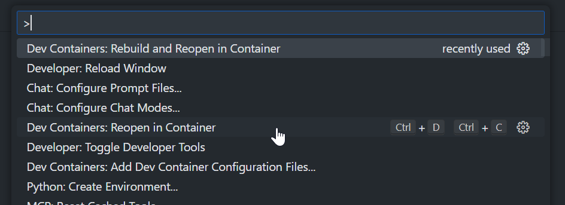

## Authenticate to Azure

- Open a terminal in Visual Studio Code
- Invoke the following command:

```bash
az login
```

## Export Resources to Terraform

The `/export-stack` agentic prompt does its best to generate Terraform templates for the Azure resources you want to export.

Note that the export will likely have errors but we will address those later with the `/testfix-stack` agentic prompt.

> [!NOTE] Note
> In the current version `/export-stack` has been tested for exporting resource groups, AI Foundry accounts and AI Foundry projects.  It may or may not work well with other resource types but we are continuing to extend and evaluate the capabilities of this feature.

- Open GitHub Copilot Chat
- Ensure that it is set to Agent Mode
- Trigger the `/export-stack` agentic prompt:

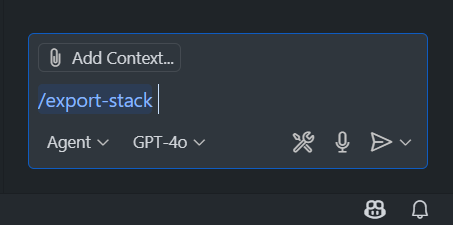

- When prompted specify the name of the resource group that you want to export and optionally the names of any specific resources:


- The agent will attempt to discover the resources that you want to export and will then check with you if it has got the list of resources correct:

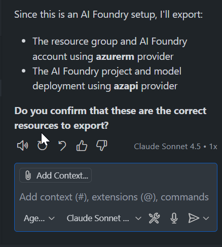

- If the list of resources it has discovered is complete and correct then you can simply confirm - otherwise you can tell the agent what else it should look for, or any resources that should be excluded.  In this case we are ready to proceed so we can simply answer "Yes":

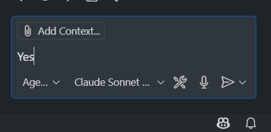

- You may be prompted to allow the agent to clean up directories that it will use:

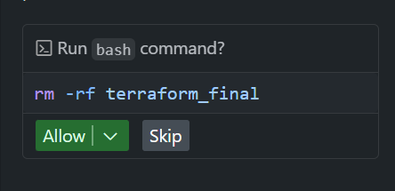

- The agent will proceed to run exports and assemble a complete stack, prompting you from time to time to allow certain critical commands to be performed:

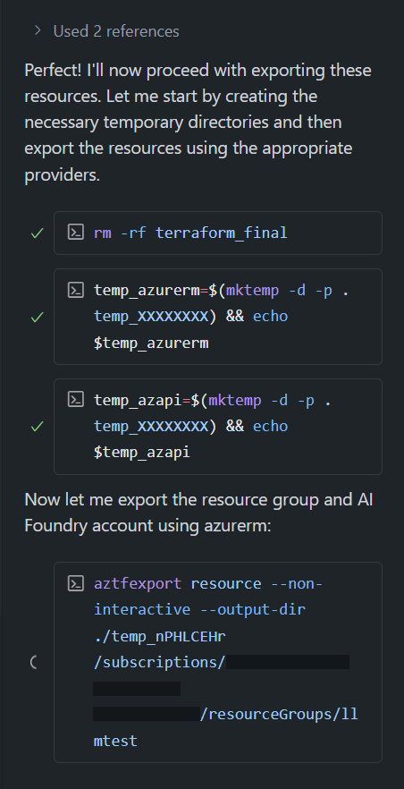

- The agent may take some time to export all the target resources and it may need to export some resources separately into different stacks.  Once it has successfully exported everything it will create a single merged stack that combines all the resources together:

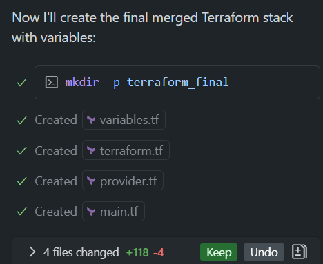

- the agent will also parameterize certain key values: the region, subscription and resource group name for the deployment.  These are defined in variables.tf and will be populated with your values as the defaults.
- Finally after merging the stacks it will attempt to validate the merged stack using `terraform init` and `terraform validate`.  It is likely the agent will encounter issues at this stage and if it does, it will further iterate to fix them:

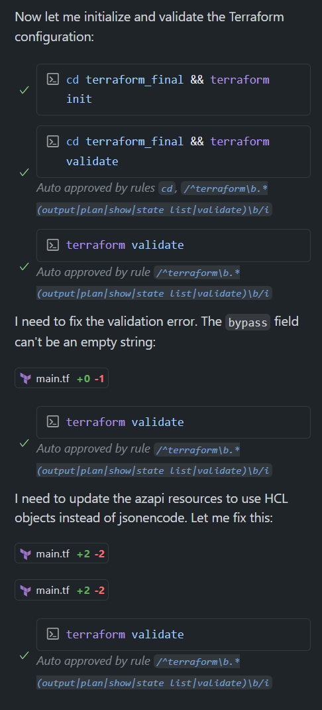

## Testing and Fixing the Exported Stack

The `/export-stack` agentic prompt that we used above did its best to export and verify the target resources to a Terraform stack, however we can't be sure the stack is valid until we actually deploy it.

When we try to use the stack it is likely that we will find issues that require us to make further changes to the Terraform templates.  This is what the next agentic prompt `/testfix-stack` is designed to do.

`/testfix-stack` will do a test deployment of your stack back to Azure, and will react to any issues it finds by iteratively fixing and retrying the deployment until it can be successfully deployed.  After `/testfix-stack` has completed its work, you will have a useable Terraform stack.

Lets try it:

- If you haven't already done so, export a stack using the `/export-stack` agentic prompt as described above.
- Once your stack has been exported, invoke the `/testfix-stack` agentic prompt:

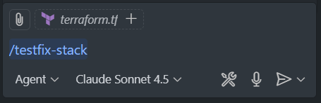

- The agent will ask you for the subscription ID and region into which the test deployment should be made.  These will be used as the values passed into the variables defined by the `/export-stack` prompt.  Provide these values to the agent via the chat:

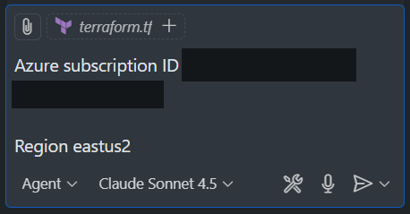

- From here the agent will attempt to deploy the stack, generating random resource group or other names where necessary.  As it encounters errors it will react by making code changes and retrying the test deployment - for example:

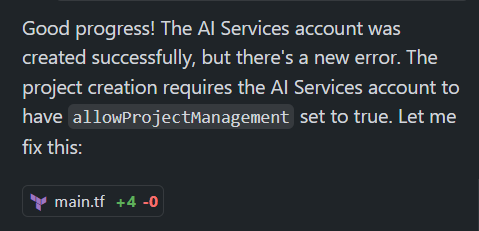

- You shouldn't need to provide input during this process except for allowing the agent to execute `terraform apply` and `terraform destroy` commands as it iterates (we have not marked these as auto-approved in `settings.json`:

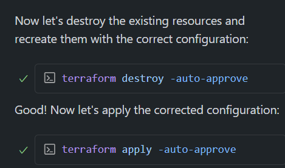

- If all goes well then eventually the agent will test and fix for all issues and give you a summary report:

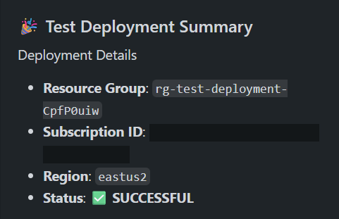

- From here you should further review the stack for compliance with your conventions and standards and run any security scanning tools that are part of your engineering standards before putting the stack to use.  Remember that AI can make mistakes, and you are ultimately responsible for the code that you ship even if you use AI to help build it.

# Trademark Notice

Trademarks This project may contain trademarks or logos for projects, products, or services. Authorized use of Microsoft trademarks or logos is subject to and must follow Microsoft’s Trademark & Brand Guidelines. Use of Microsoft trademarks or logos in modified versions of this project must not cause confusion or imply Microsoft sponsorship. Any use of third-party trademarks or logos are subject to those third-party’s policies.
